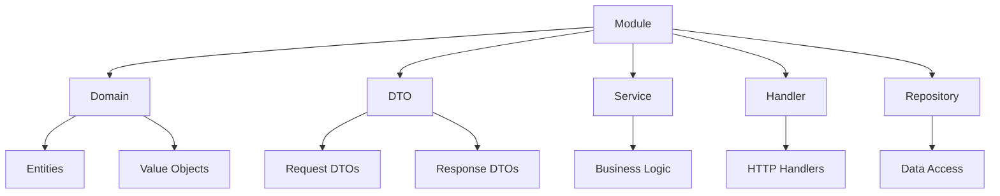
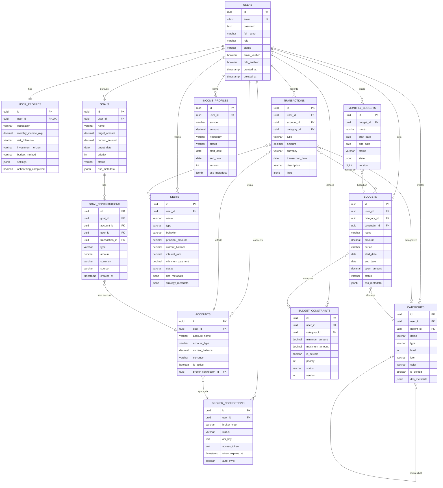

# Personal Finance — Backend

## Name and Introduction

Personal Finance is a personal finance management system. The backend exposes a REST API for managing accounts, transactions, budgets, goals, debts, income, and monthly budget allocation.

## Tech Stack

- **Language:** Go 1.24
- **Web framework:** Gin
- **ORM:** GORM (PostgreSQL, SQLite for tests)
- **Database:** PostgreSQL 18 (Alpine)
- **Cache / session:** Redis 7 (Alpine)
- **Authentication:** JWT (golang-jwt/jwt/v5), HTTP-only cookie for refresh token
- **Configuration:** Viper, environment variables
- **DI:** Uber FX
- **Logging:** Uber Zap
- **API documentation:** Swag (Swagger 2.0), gin-swagger
- **Rate limiting:** golang.org/x/time (rate)
- **Operations:** Docker, Docker Compose (PostgreSQL + Redis)

Details are in `go.mod` and `deploy/docker-compose.yml`.

## System Architecture

The backend is organized in a modular (Clean Architecture–lite) style: domains are split into modules, each with its own handler, service, repository, and domain layer.

### Main Directory Structure

- **`cmd/`**  
  Application entry point: CLI (Cobra). `cmd/server/main.go` invokes `cmd/cli`; subcommands include `serve`, `migrate`, `migrate reset`, `db`, `seed`.

- **`internal/`**  
  Private application code; not imported by external projects.

  - **`internal/config`**  
  Loads configuration from `.env` (Viper), with preference for the `deploy/` directory and relative paths when running from `cmd/server`.

  - **`internal/database`**  
  Migrator (GORM AutoMigrate) and seed data (users, categories, profiles, etc.).

  - **`internal/fx`**  
  Uber FX application bootstrap: DB and Redis connections, logger, middleware, route registration, migration/seed execution, HTTP server startup.

  - **`internal/logger`**  
  Zap logger configuration.

  - **`internal/middleware`**  
  Shared middleware: auth (JWT, refresh token), CORS, error handler, logger, rate limiter, email verification.

  - **`internal/module`**  
  Domain modules. Each typically has: `domain/`, `dto/`, `handler/`, `service/`, `repository/`, `fx.go` (DI). Examples: `identify/auth`, `identify/user`, `identify/profile`, `identify/broker`, `cashflow/account`, `cashflow/transaction`, `cashflow/budget`, `cashflow/budget_profile`, `cashflow/goal`, `cashflow/debt`, `cashflow/category`, `cashflow/income_profile`, `calendar/event`, `calendar/month`, `investment/*`, `analytics/*`, `notification`, `chatbot`.

  - **`internal/service`**  
  Shared services (e.g. encryption) not tied to a single module.

  - **`internal/shared`**  
  Shared code: constants, error definitions (AppError, error codes), helpers, response formatting (RespondWithSuccess, RespondWithError), logger wrapper.

- **`docs/`**  
  Swagger output generated by Swag: `docs.go`, `swagger.json`, `swagger.yaml`.

- **`deploy/`**  
  Deployment assets: `docker-compose.yml`, `.env.example`, Dockerfile.

- **`resource/`**  
  Static assets (e.g. HTML email templates).

#### Directory tree overview

```text
server/
  cmd/
    cli/              # Cobra commands: serve, migrate, db, seed, ...
    server/           # main.go entrypoint

  internal/
    config/           # Load and validate config (.env, Viper)
    database/         # AutoMigrate and seeders
    fx/               # Uber FX app wiring (DI, routes, server)
    logger/           # Zap logger setup
    middleware/       # Auth, CORS, error handler, logger, rate limiter, email verification
    module/           # Domain modules
      identify/
        auth/
        user/
        profile/
        broker/
      cashflow/
        account/
        transaction/
        budget/
        budget_profile/
        goal/
        debt/
        category/
        income_profile/
      calendar/
        month/
      investment/
        investment_asset/
        investment_transaction/
        portfolio_snapshot/
      analytics/
        budget_allocation/
        goal_prioritization/
        debt_strategy/
      notification/
    service/          # Shared helper services (e.g. encryption)
    shared/           # Errors, constants, helpers, response wrappers

  docs/               # Swagger docs (docs.go, swagger.json, swagger.yaml)

  deploy/
    docker-compose.yml
    .env.example
    Dockerfile

  resource/
    email_templates/  # HTML email templates
```

#### Module component structure 



## Key Features

- **Authentication:** Register, login (email/password), Google OAuth, JWT access token with HTTP-only cookie refresh token, logout (token blacklist).
- **Token blacklist:** Stores revoked refresh tokens (logout, password change); checked on refresh and when needed.
- **Rate limiting:** Request limits per IP (configured via RATE_LIMIT_*).
- **User and profile:** CRUD for users, profiles, onboarding.
- **Email verification:** Verify email, forgot password, change password (SMTP).
- **Accounts:** Bank, e-wallet, and cash accounts; transaction sync via brokers (SePay, SSI, etc.).
- **Transactions:** Debit/credit transactions, import from bank API/CSV/JSON, link to budget/goal/debt, categories.
- **Budgets and budget constraints:** Period-based budgets, spending constraints.
- **Goals and debts:** Financial goals, debt payoff, contributions from accounts.
- **Categories and income profiles:** Income/expense categories, income sources.
- **Calendar and month DSS:** Calendar events, monthly budget allocation (DSS workflow).
- **Investment:** Investment assets, investment transactions, portfolio snapshots.
- **Notification:** Notifications, WebSocket, preferences.

## Getting Started

### Prerequisites

- Go 1.25 (or version specified in `go.mod`)
- Docker and Docker Compose (for PostgreSQL and Redis)
- Optional tools: Swag (`go install github.com/swaggo/swag/cmd/swag@latest`), Air (hot reload), just

### Environment Variables

1. Copy the sample file: `cp deploy/.env.example deploy/.env` (or place `.env` at the server root).
2. The application reads `.env` via Viper; it looks in `deploy/` and `server/deploy/` first (see `internal/config/config.go`).
3. Minimum configuration:
   - **Database:** `DATABASE_URL` or `DB_HOST`, `DB_PORT`, `DB_USER`, `DB_PASSWORD`, `DB_NAME`
   - **Server:** `PORT` (default 8080), `HOST`
   - **JWT:** `JWT_SECRET`, `JWT_EXPIRATION`
   - **CORS:** `CORS_ORIGINS` (e.g. `http://localhost:3000`)
   - **Redis:** `REDIS_URL` (e.g. `redis://localhost:6379`)
   - **Rate limiting:** `RATE_LIMIT_REQUESTS`, `RATE_LIMIT_WINDOW`
   - Email, Google OAuth, encryption key, etc. as in `deploy/.env.example`

### Running PostgreSQL and Redis

```bash
cd deploy
docker-compose up -d
```

### Migration

```bash
go run ./cmd/server migrate
```

Full reset (drops data and re-runs migrations):

```bash
go run ./cmd/server migrate reset
```

### Running the Server

Direct run:

```bash
go run ./cmd/server serve
```

Or with just (if available):

```bash
just dev
```

or:

```bash
just start
```

The server listens at `http://<HOST>:<PORT>` (typically `http://localhost:8080`).

## API Documentation

- **Base URL:** `http://localhost:8080/api/v1` (adjust for your `PORT` and `HOST`).
- **Swagger UI:** After the server is running, open `http://localhost:8080/swagger/index.html` (or `/swagger-ui/index.html`). The UI uses Swagger 2.0.
- **Spec files:** YAML/JSON are served at `/openapi/swagger.yaml` and `/openapi/swagger.json`.
- **Regenerating Swagger:** `just swagger` or `swag init -g cmd/server/main.go --output docs --parseDependency --parseInternal` (run from the server root).

Main endpoint groups (by module): Auth (register, login, refresh, logout, Google), Users, Profiles, Accounts, Categories, Income Profiles, Budgets, Budget Constraints, Goals, Debts, Transactions, Investment Assets/Transactions/Snapshots, Calendar Events, Month/DSS Workflow, Budget Allocation, Goal Prioritization (AHP), Notifications, WebSocket, Preferences, Brokers. For per-route details, use Swagger UI or the source under `internal/module/*/handler` and `internal/fx/app.go`.


## ER Diagram


