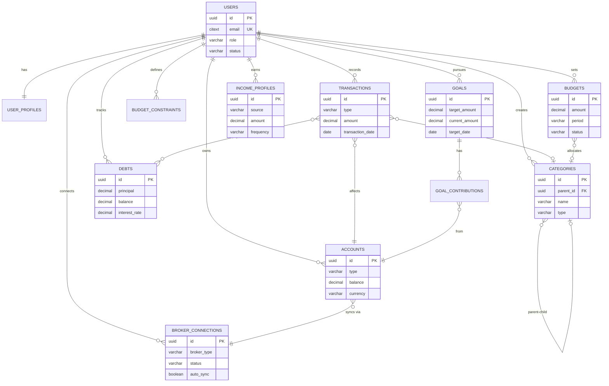

# Personal Finance — Backend

REST API backend for personal finance management: accounts, transactions, budgets, goals, and debts.

## Tech Stack

| |                                        |
|---|----------------------------------------|
| Language | Go 1.26                                |
| Framework | Gin                                    |
| ORM | GORM + PostgreSQL                      |
| Cache | Redis 7                                |
| Auth | JWT + HTTP-only cookie (refresh token) |
| Config | Viper + `.env`                         |
| DI | Uber FX                                |
| Logging | Uber Zap                               |
| API Docs | Swagger 2.0 (swag)                     |

## Directory Structure

```text
server/
├── cmd/server/           # main.go — entry point
├── internal/
│   ├── app/              # FX bootstrap (DB, Redis, routes, HTTP server)
│   ├── config/           # Config loading (Viper)
│   ├── infra/database/   # GORM AutoMigrate + seeders
│   ├── middleware/        # JWT auth, CORS, error handler, rate limiter
│   ├── shared/           # AppError, response helpers
│   └── module/
│       ├── identify/
│       │   ├── auth/         # Register, login, Google OAuth, JWT, logout
│       │   ├── user/         # User CRUD
│       │   ├── profile/      # Profile & onboarding
│       │   └── broker/       # Broker connections (bank sync)
│       ├── cashflow/
│       │   ├── account/      # Accounts (bank, e-wallet, cash)
│       │   ├── transaction/  # Transactions, CSV/JSON import
│       │   ├── category/     # Income/expense categories
│       │   ├── income_profile/ # Income sources
│       │   ├── budget/       # Budgets
│       │   ├── budget_profile/ # Budget constraints
│       │   ├── goal/         # Financial goals
│       │   └── debt/         # Debts & payments
│       ├── calendar/
│       │   ├── event/        # Calendar events
│       │   └── month/        # Monthly planning
│       └── notification/     # Notifications
├── docs/                 # Swagger output
├── deploy/               # Dockerfile, docker-compose.yml, .env.example
└── resource/             # Email templates
```

## Getting Started

### 1. Environment

```bash
cp deploy/.env.example deploy/.env
```

Key variables:

| Variable | Default |
|---|---|
| `DB_HOST`, `DB_PORT`, `DB_USER`, `DB_PASSWORD`, `DB_NAME` | PostgreSQL connection |
| `REDIS_URL` | `redis://localhost:6379` |
| `PORT` | `8080` |
| `JWT_SECRET` | — |
| `CORS_ORIGINS` | `http://localhost:3000` |

### 2. Start Infrastructure

```bash
cd deploy && docker-compose up -d
```

### 3. Run

```bash
go run ./cmd/server
```

> Migrations run automatically on startup. In development mode, seed data is also applied if the database is empty.

- API: `http://localhost:8080/api/v1`
- Swagger: `http://localhost:8080/swagger/index.html`

## Regenerate Swagger

```bash
swag init -g cmd/server/main.go --output docs --parseDependency --parseInternal
```

## ER Diagram


```mermaid
erDiagram
    USERS ||--|| USER_PROFILES : "has"
    USERS ||--o{ BROKER_CONNECTIONS : "connects"
    USERS ||--o{ ACCOUNTS : "owns"
    USERS ||--o{ TRANSACTIONS : "records"
    USERS ||--o{ CATEGORIES : "creates"
    USERS ||--o{ BUDGETS : "sets"
    USERS ||--o{ BUDGET_CONSTRAINTS : "defines"
    USERS ||--o{ DEBTS : "tracks"
    USERS ||--o{ GOALS : "pursues"
    USERS ||--o{ INCOME_PROFILES : "earns"

    ACCOUNTS }o--|| BROKER_CONNECTIONS : "syncs via"
    TRANSACTIONS }o--|| ACCOUNTS : "affects"
    TRANSACTIONS }o--o| CATEGORIES : "categorized by"
    BUDGETS }o--o| CATEGORIES : "allocates"
    CATEGORIES }o--o| CATEGORIES : "parent-child"
    GOALS ||--o{ GOAL_CONTRIBUTIONS : "has"
    GOAL_CONTRIBUTIONS }o--|| ACCOUNTS : "from"
    TRANSACTIONS }o--o{ DEBTS : "pays"

    USERS {
        uuid id PK
        citext email UK
        varchar role
        varchar status
    }
    ACCOUNTS {
        uuid id PK
        varchar type
        decimal balance
        varchar currency
    }
    TRANSACTIONS {
        uuid id PK
        varchar type
        decimal amount
        date transaction_date
    }
    CATEGORIES {
        uuid id PK
        uuid parent_id FK
        varchar name
        varchar type
    }
    BUDGETS {
        uuid id PK
        decimal amount
        varchar period
        varchar status
    }
    GOALS {
        uuid id PK
        decimal target_amount
        decimal current_amount
        date target_date
    }
    DEBTS {
        uuid id PK
        decimal principal
        decimal balance
        decimal interest_rate
    }
    INCOME_PROFILES {
        uuid id PK
        varchar source
        decimal amount
        varchar frequency
    }
    BROKER_CONNECTIONS {
        uuid id PK
        varchar broker_type
        varchar status
        boolean auto_sync
    }
```
